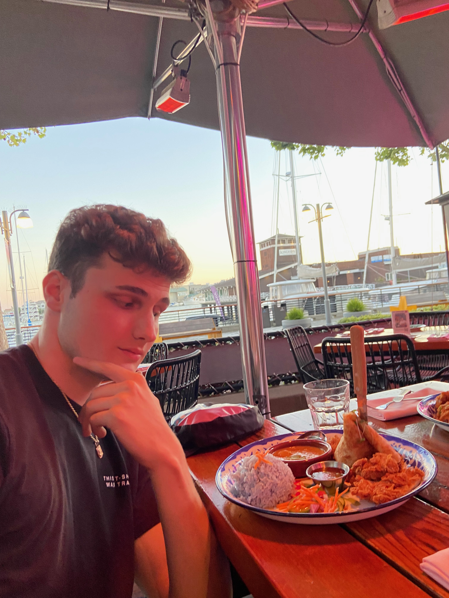

<!DOCTYPE html>
<html>
 <meta charset="UTF-8">
    <meta name="viewport" content="width=device-width, initial-scale=1.0">  
  <head>
    
  </head>
  <body>
    <header>
      <h1>Howdy! I'm Parker Jackson Bovée!</h1>
      <nav>
        <li><a href="#about-me">About Me</a></li>
          <li><a href="#past-research">Past Research</a></li>
          <li><a href="#contact-me">Contact Me</a></li>
        </ul>
      </nav>
    </header>
    <main>
      <section id="about-me">
        <h2>About Me</h2>
        
Glad that you found my page! While you are here, let me introduce myself: I am a proud alumni of both UC Berkeley (Go Bears!) and Duke. I am a fourth generation Californian and committed to ensuring the state's economic and environmental future. 
I consider myself as an out-of-the-box thinker and have previously used my skills to tackle nuanced problems such as wildfire, political divisiveness, and healthcare access in both political and business settings. In the future, I hope to marry my lifelong interest in entrepreneurship with passions for mission-driven service and environmental science in a start-up that utilizes all three areas! 
Currently, I perform research for the <a href="https://www.cleantech.com/">Cleantech Group</a> where I work in sectors ranging from materials & chemicals to agriculture & food.
        

      </section>
      <section id="past-research">
        <h2>Past Research</h2>
        <ul>
          <li><a href="https://www.cleantech.com/proactive-stormwater-management-and-flood-resilience/">My latest published work! This is a summary of larger research into flood adaptive infrastructure and stormwater management.</a></li>          
          <li><a href="https://undergradjournal.history.ucsb.edu/wp-content/uploads/2022/12/1.-Complete-Fall-2022-Issue.Final_.pdf">This one is a historical analysis of artistic censorship and politicization in 20th century Germany.</a></li>
          <li><a href="https://docs.google.com/document/d/15nrPh3QQm16GvBhbxCXoy6qWOEYliGbk7BKhX-Jt74M/edit">My graduating thesis from UC Berkeley! Focuses on The Sea Ranch, California, and the beautiful, messy, paradoxical story of its founding, development, and future.</a></li>
          <li><a href="https://escholarship.org/uc/item/387259rn">An analysis I did on how cinema influenced gender dynamics in 1920s Shanghai.</a></li>
          <li><a href="https://digitalcommons.georgiasouthern.edu/aujh/vol10/iss1/6/">Comparative research on religion as a political tool within various Chinese governments.</a></li>
          <li><a href="https://www.ocf.berkeley.edu/~rics/?p=656">Documenting human rights abuses and their casues in China.</a></li>
        </ul>
      </section>
      <section id="contact-me">
        <h2>Contact Me</h2>
        
Follow me on <a href="https://www.linkedin.com/in/parker-j-bovee/">LinkedIn,</a> where I talk about the environmental technology space.

      </section>
    </main>
    <footer>
      
&copy; 2023 My Personal Website

    </footer>
  </body>
</html>
